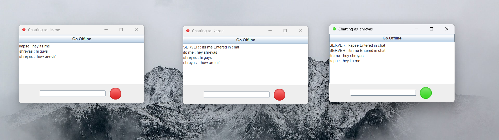
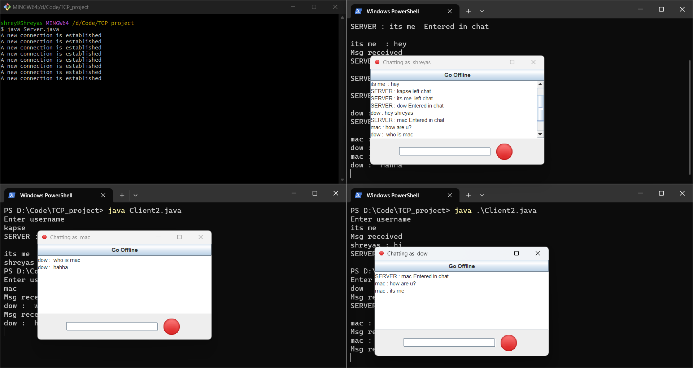
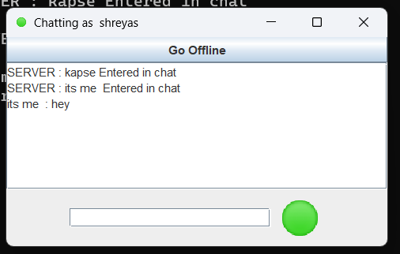
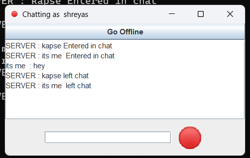
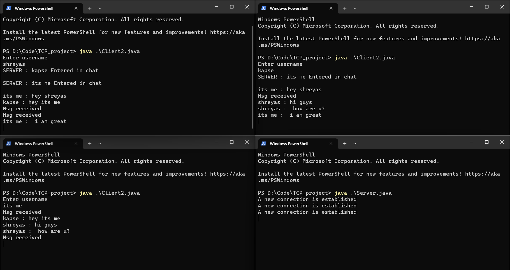

# JavaChatXpress - Real-Time Java Chat Application

## Overview
Enhance your communication experience with JavaChatXpress, a powerful and dynamic real-time chat application crafted in Java. Elevate your interactions with features such as user notifications for new joiners and departures, along with message transmission indicators. Embrace seamless communication through this project, showcasing the prowess of socket programming, multi-threading, and user-friendly graphical interfaces.

## Key Features

- **Multi-Client Group Chat:** Engage in vibrant group conversations with multiple users within a shared chat environment.

- **Instant Messaging:** Immerse yourself in the immediacy of real-time message delivery for responsive communication.

- **User Notifications:** Stay in the loop with automatic notifications for new user arrivals and departures, fostering a sense of community.

- **Message Transmission Indicators:** Boost clarity in communication with green signals signifying successful message transmission.

- **Client-Server Architecture:** Built on a robust client-server model, ensuring efficient and reliable message exchange.

- **Graphical User Interface:** Enjoy an intuitive, user-friendly GUI designed with Java's Swing library.

- **Quick Setup:** Seamlessly initiate your journey with a straightforward setup process, catering to users of varying technical proficiencies.

## Getting Started

1. Compile the necessary classes:
   - `javac ClientHandler.java`
   - `javac Server.java`

2. Start the server:
   - `java Server`

3. Launch multiple client instances:
   - **For GUI Client** (with graphical user interface):
     - Compile: `javac Client2.java`
     - Run: `java Client2`

   - **For Non-GUI Client** (without graphical user interface):
     - Compile: `javac Client.java`
     - Run: `java Client`

4. Enter unique usernames for each client and embark on real-time chatting with user notifications and message transmission indicators.

## Project Images

*Screenshot 1: Group chat interface with user notifications*

*Screenshot 2: Group chat interface with multiple clients*

*Screenshot 3: Message transmission successful indicator in action*

*Screenshot 4:Group chat interface on the console*

## Contributions

Contributions from the community are encouraged to enhance JavaChatXpress. Submit pull requests and suggestions for a more engaging platform.

## Future Development

Exciting plans for JavaChatXpress's development lie ahead, including additional features and optimizations. Stay tuned for updates!

## License

This project is licensed under the [MIT License](LICENSE).

Join us in elevating communication experiences with JavaChatXpress. Download, connect, and converse seamlessly!

---
## Contact Information
For any inquiries or further information, please contact the project maintainer at shreyaskapse171@gmail.com.
